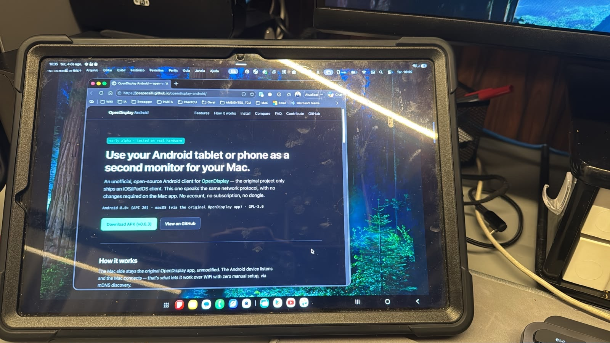
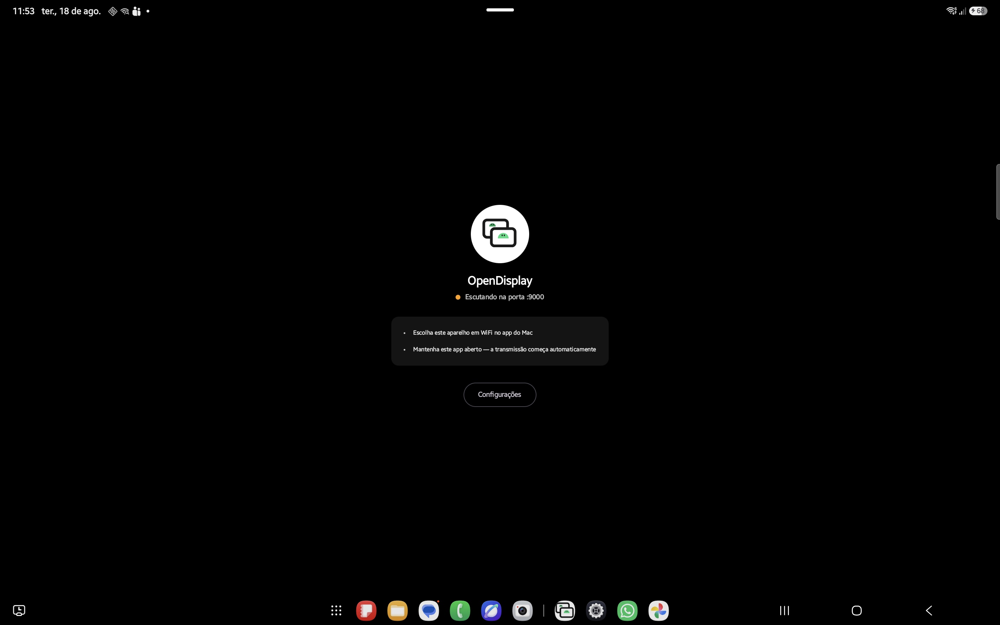

# OpenDisplay Android

**Turn your spare Android tablet into a second monitor for your Mac** — free, open source, no
subscription.

Unofficial Android client for [OpenDisplay](https://github.com/peetzweg/opendisplay), filling the
role of Sidecar/Duet Display: a real extended display (not just mirroring), low-latency H.264,
over WiFi or USB, with touch and scroll input — speaking the same network protocol as the
official app, with no changes required on the Mac side.

[Website & download](https://opendisplay.jpmo.dev.br) ·
[How it works](#how-it-works) · [Screenshots](#screenshots) · [Features](#features) ·
[Compare](#compare) · [Install](#install) · [Build](#build) · [Usage](#usage) ·
[License](#license)

The original OpenDisplay project only ships an iOS/iPadOS client. This repository is the Android
version: the wire protocol, framing and Annex-B handling are ported from the upstream Swift
client, while the Android UI and `MediaCodec` pipeline are written fresh in Kotlin.

## How it works

```
MAC (sender, original project, unmodified)         ANDROID (this project)
CGVirtualDisplay
  → ScreenCaptureKit → VideoToolbox H.264
  → TCP [4-byte length BE][Annex-B frame] ══════→ listens on port 9000
                                                        → MediaCodec (Surface) → SurfaceView
  ← control JSON (hello, touch, scroll, ping) ════
```

The Android device listens and the Mac connects — that's what lets it work over WiFi with zero
manual setup, via mDNS/Bonjour discovery (`_opensidecar._tcp`).

## Screenshots

 

No staged mockups — real hardware, real WiFi connection. More shots (settings, mid-session
mirroring, the Mac's Displays panel) on the [website](https://opendisplay.jpmo.dev.br/#screenshots).

## Features

- H.264 video reception via `MediaCodec` (hardware decoding), straight to a `Surface`.
- Handshake, ping/pong and mDNS discovery compatible with the original Mac sender's protocol.
- One-finger touch becomes a mouse click/drag; a two-finger gesture becomes scroll.
- Overlaid remote cursor (dot or decoded sprite, mirroring the Mac's cursor).
- Foreground service: the connection survives the app going to background and resumes correctly
  after unlocking the screen.
- Auto-enters Picture-in-Picture when you leave the app while connected — same as Netflix/Prime
  Video — so the video keeps playing in a floating window while you use something else.
- Editable mDNS name; the settings screen also shows this device's own address for troubleshooting.
- Optional performance HUD (fps, end-to-end latency, RTT).
- Adaptive UI (Jetpack Compose) for phone and tablet.

## Compare

For using an Android tablet as an external monitor, against the best-known alternatives:

| | OpenDisplay Android | Duet Display | Spacedesk |
|---|---|---|---|
| Price | Free | Paid | Free (core) |
| Open source | GPL-3.0 | No | No |
| Account required | No | Yes | No |
| Same protocol as OpenDisplay Mac | Yes | No | No |
| Central server | None | Yes | No |

## Requirements

- Android 8.0 (API 26) or higher. **v0.0.7 and earlier crash on launch on Android 12–13
  (API 30-33)** — `WindowMetrics.getDensity()` was gated behind the wrong API level; fixed in
  v0.0.8, use that or newer (reported by [@gaeaearth](https://github.com/gaeaearth), fixed by
  [@edoardomich](https://github.com/edoardomich) in [#5](https://github.com/josepacelli/opendisplay-android/pull/5)).
- Same WiFi network as the Mac (or a USB connection via `adb forward` — see below).
- The original [OpenDisplay](https://github.com/peetzweg/opendisplay) Mac app, unmodified.
- Tested on real hardware (Samsung Galaxy Tab S9 FE+ and Galaxy Note10+/Tab S7+, Android 12
  through 16) — not yet across a wide range of devices.

## Install

Download the latest APK from [GitHub Releases](https://github.com/josepacelli/opendisplay-android/releases/latest)
and sideload it (`adb install`, or copy it to the device and enable "unknown sources").

The Google Play version is in closed testing — want in as a tester? Email
[josepacelli@gmail.com](mailto:josepacelli@gmail.com).

## Build

```sh
./gradlew assembleDebug          # build
./gradlew installDebug           # install on a connected device/emulator
adb logcat -s OpenDisplay:*      # app logs
```

Requires the Android SDK installed, with `ANDROID_HOME`/`local.properties` pointing to it.

To produce a signed release APK, set up a release keystore and a `keystore.properties` file at
the repo root (both kept out of version control) — see `app/build.gradle.kts` for the expected
format, then run `./gradlew assembleRelease`.

## Usage

1. Open the app on Android — it starts advertising itself via mDNS and listening on port 9000.
2. On the Mac, open the original OpenDisplay app in `extend` mode (WiFi) and pick the Android
   device from the list.
3. If the Mac doesn't see the device, check that both are on the same WiFi network and that it
   isn't blocking multicast/mDNS traffic — the Mac app has no manual IP-entry field, so WiFi
   discovery is the only supported path (USB is the fallback, see below).

USB connection details (via `adb forward`, without requiring `usbmuxd`) are covered in
[peetzweg/opendisplay's `Mac/OpenSidecarMacApp.swift`](https://github.com/peetzweg/opendisplay) —
the Mac app dials plain TCP to a configured `host`/`port` override when set, which `adb forward`
can tunnel over USB to this app's existing listener on port 9000.

## Relationship to the original project

This is an independent client, maintained separately, that implements the same network protocol
as [OpenDisplay](https://github.com/peetzweg/opendisplay) (`peetzweg/opendisplay`) to interoperate
with the original Mac app without requiring any change to it. It is not affiliated with the
original project's author.

## Acknowledgments

- [@gaeaearth](https://github.com/gaeaearth) has been this project's most active early tester —
  reported the Android 12/13 launch crash
  ([#4](https://github.com/josepacelli/opendisplay-android/issues/4)), the screen-timeout/
  reconnect issues ([#10](https://github.com/josepacelli/opendisplay-android/issues/10), also the
  suggestion behind the idle-screen fix in
  [#28](https://github.com/josepacelli/opendisplay-android/issues/28)), and the misleading
  manual-connection hint ([#18](https://github.com/josepacelli/opendisplay-android/issues/18)).
  Thank you for the sustained, careful bug reports.
- [@edoardomich](https://github.com/edoardomich) fixed the Android 12/13 launch crash
  ([#5](https://github.com/josepacelli/opendisplay-android/pull/5)).
- [@jpbhdrey](https://github.com/jpbhdrey) built the USB accessory (AOA) transport
  ([#33](https://github.com/josepacelli/opendisplay-android/pull/33)) — plug the cable, tap the
  system's prompt, no developer options or `adb` dance required.
- [@dyss1992](https://github.com/dyss1992) reported the Mirror mode aspect ratio bug on some
  Qualcomm decoders, with a controlled before/after comparison that made the root cause obvious
  ([#44](https://github.com/josepacelli/opendisplay-android/issues/44)), and suggested the
  immersive fullscreen mode
  ([#45](https://github.com/josepacelli/opendisplay-android/issues/45)).

## Support

One-person side project, built evenings and weekends, not a company. If it saved you from buying
a monitor, [a tip on Ko-fi](https://ko-fi.com/Q3D5259MWT) helps keep it maintained and free for
everyone.

## License

GPL-3.0, the same license as the original project. See [`LICENSE`](LICENSE) and
[`NOTICE`](NOTICE) for copyright notices.
